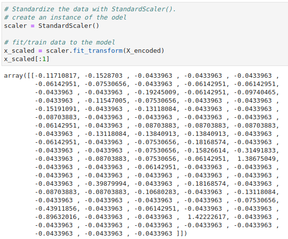
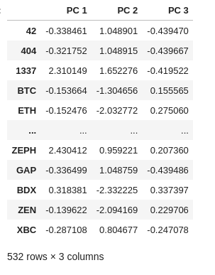
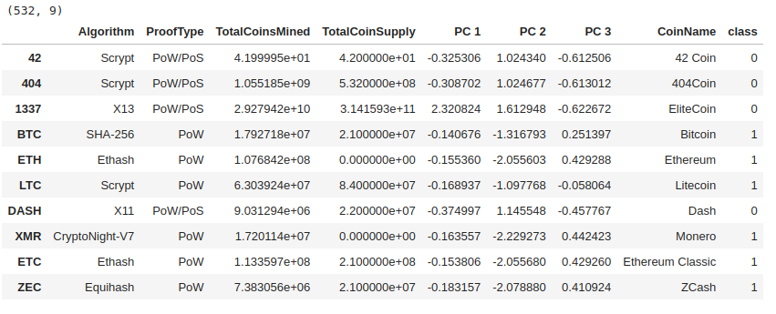
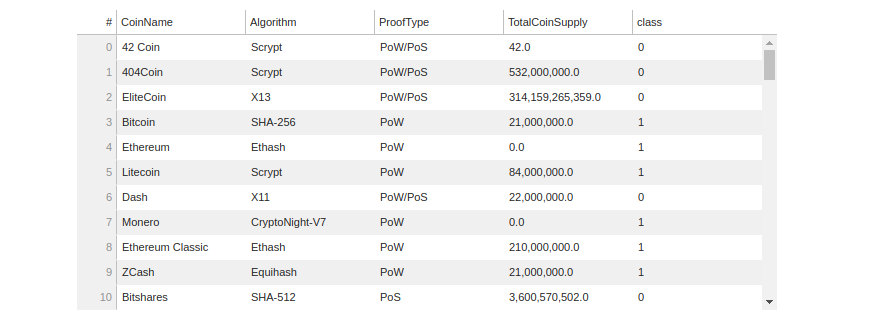
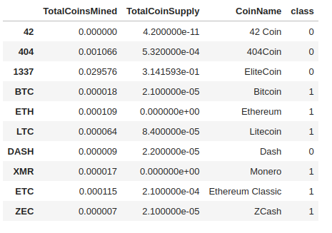
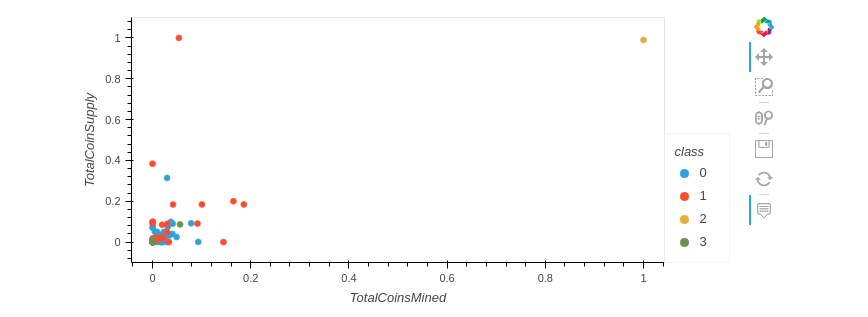

# Cryptocurrencies
Using Unsupervised Machine Learning to Discover Unknown Patterns

## Background

### Overview of Analysis

This project consists of three technical analysis deliverables and a written report.

* Deliverable 1: Preprocessing the Data for PCA

* Deliverable 2: Reducing Data Dimensions Using PCA

* Deliverable 3: Clustering Cryptocurrencies Using K-means

* Deliverable 4: Visualizing Cryptocurrencies Results

### Purpose

Stakeholders are interested in offering a new cryptocurrency investment portfolio for its customers. The company, however, is lost in the vast universe of cryptocurrencies. So, we'll create a report that includes what cryptocurrencies are on the trading market and how they could be grouped to create a classification system for this new investment.

The data we will be working with is not ideal, so it will need to be processed to fit the machine learning models. Since there is no known output for what we are looking for, we have decided to use unsupervised learning. To group the cryptocurrencies, we decided on a clustering algorithm. We’ll use data visualizations to share our findings with the board.

## Resources

Data source:

- (1) crypto_clustering_starter_code, (2) cryptocurrency data (crypto_data.csv)

Software:

- Python 3.9.10, Jupyter Lab 4.6, Visual Studio Code 1.71.2
 
 

## Methodology

### D1: Preprocessing the Data for PCA 

Using your knowledge of Pandas, you’ll preprocess the dataset in order to perform PCA in Deliverable 2.

 

### D2: Reducing Data Dimensions Using PCA

Using your knowledge of how to apply the Principal Component Analysis (PCA) algorithm, you’ll reduce the dimensions of the X DataFrame to three principal components and place these dimensions in a new DataFrame.

 

### D3: Clustering Cryptocurrencies Using K-means

Using your knowledge of the K-means algorithm, you’ll create an elbow curve using hvPlot to find the best value for K from the pcs_df DataFrame created in Deliverable 2. Then, you’ll run the K-means algorithm to predict the K clusters for the cryptocurrencies’ data.

 

### D4: Visualizing Cryptocurrencies Results

Using your knowledge of creating scatter plots with Plotly Express and hvplot, you’ll visualize the distinct groups that correspond to the three principal components you created in Deliverable 2, then you’ll create a table with all the currently tradable cryptocurrencies using the hvplot.table() function.

 

## Results:

### D1: Preprocessing the Data for PCA 

The following five preprocessing steps have been performed on the crypto_df DataFrame:

* All cryptocurrencies that are not being traded are removed

* The IsTrading column is dropped

* All the rows that have at least one null value are removed

* All the rows that do not have coins being mined are removed

* The CoinName column is dropped

* A new DataFrame is created that stores all cryptocurrency names from the CoinName column and retains the index from the crypto_df DataFrame

* The get_dummies() method is used to create variables for the text features, which are then stored in a new DataFrame, X 

* The features from the X DataFrame have been standardized using the StandardScaler fit_transform() function

The final DataFrame is shown below, Figure 1.1

 
 Figure (1.1) X_scaled DataFrame

 

### D2: Reducing Data Dimensions Using PCA

* The pca algorithm reduces the dimensions of the X DataFrame down to three principal components
* The X_pca_df DataFrame is created and has the following three columns, PC 1, PC 2, and PC 3, and has the index from the crypto_df DataFrame

The final DataFrame is shown below, Figure 1.2
 
 
 
 Figure (1.2) X_pca_df DataFrame

 

### D3: Clustering Cryptocurrencies Using K-means

* The K-means algorithm is used to cluster the cryptocurrencies using the PCA data, where the following steps have been completed:

* An elbow curve is created using hvPlot to find the best value for K

 
 Figure (1.3) Elbow curve

 

* Predictions are made on the K clusters of the cryptocurrencies’ data

 
 Figure (1.3) Elbow curve

 

* A new DataFrame is created with the same index as the crypto_df DataFrame and has the following columns: Algorithm, ProofType, TotalCoinsMined, 

* TotalCoinSupply, PC 1, PC 2, PC 3, CoinName, and Class

 
 Figure (1.3) Clustered_df

 

 
### D4: Visualizing Cryptocurrencies Results

* The clusters are plotted using a 3D scatter plot, and each data point shows the CoinName and Algorithm on hover

 
 Figure (1.3) 3D Scatter pplot

 

* A table with tradable cryptocurrencies is created using the hvplot.table() function

 
 Figure (1.3) hvplot table

 

* The total number of tradable cryptocurrencies is printed

 
 Figure (1.3) Total number of tradable cryptocurrencies

 

* A DataFrame is created that contains the clustered_df DataFrame index, the scaled data, and the CoinName and Class columns

 
 Figure (1.3) DataFrame that has the scaled data with the clustered_df DataFrame index

 

* A hvplot scatter plot is created where the X-axis is "TotalCoinsMined", the Y-axis is "TotalCoinSupply", the data is ordered by "Class", and it shows the CoinName when you hover over the data point

 
 Figure (1.3) hvplot scatter plot

 

## Summary

## References

[Markdown](https://docs.github.com/en/get-started/writing-on-github/getting-started-with-writing-and-formatting-on-github/basic-writing-and-formatting-syntax)

[scikit-learn](https://scikit-learn.org/stable/)
 
[imbalanced-learn](https://imbalanced-learn.org/stable/)

